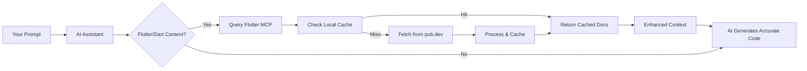

# Flutter MCP: Give Your AI Real-Time Flutter Superpowers 🚀

**A real-time MCP server providing Flutter/Dart documentation and pub.dev package info to AI assistants — supports ALL 50,000+ packages on demand.**

Stop fighting with hallucinated widgets and deprecated APIs. Flutter MCP connects your AI assistant to real-time documentation, ensuring the Flutter code it generates actually works.

<p align="center">
  
  
  
  
</p>

<p align="center">
  <a href="#-quick-start">Quick Start</a> •
  <a href="#-demo">Demo</a> •
  <a href="#-features">Features</a> •
  <a href="#-how-it-works">How it Works</a> •
  <a href="#-contributing">Contributing</a>
</p>

## 🎬 Demo

<p align="center">
  
</p>

**See it in action**: From `flutter-mcp start` to getting real-time Flutter documentation in 20 seconds.

## The Problem: Your AI is Stuck in 2021

<table>
<tr>
<td width="50%" align="center">

### 😡 Without Flutter MCP

```dart
// User: "How do I use Riverpod to watch a future?"

// AI generates (outdated):
final userProvider = FutureProvider((ref) async {
  return fetchUser();
});

// WRONG! Missing autoDispose, family, etc.
```

**Result**: Deprecation warnings, confused debugging, time wasted on Google

</td>
<td width="50%" align="center">

### ✅ With Flutter MCP

```dart
// User: "How do I use @flutter_mcp riverpod to watch a future?"

// AI generates (current v2.5.1):
final userProvider = FutureProvider.autoDispose
  .family<User, String>((ref, userId) async {
    return ref.watch(apiProvider).fetchUser(userId);
});

// Correct, modern, actually works!
```

**Result**: Code works immediately, you ship faster

</td>
</tr>
</table>

## 🚀 Quick Start

### Installation (One Command!)

```bash
# Install and run
pip install flutter-mcp-server
flutter-mcp start
```

That's it! No Redis, no configuration, no complexity. The server is now running with built-in caching.

### Alternative Options

<details>
<summary><strong>🐳 Docker (Zero Dependencies)</strong></summary>

```bash
# Run with Docker
docker run -p 8000:8000 ghcr.io/flutter-mcp/flutter-mcp:latest

# Or use Docker Compose
cd flutter-docs-mcp
docker-compose up
```

</details>

<details>
<summary><strong>🎯 Single Executable (Coming Soon)</strong></summary>

```bash
# Download for your platform
curl -L https://github.com/flutter-mcp/releases/latest/flutter-mcp-macos -o flutter-mcp
chmod +x flutter-mcp
./flutter-mcp
```

No Python, no pip, just download and run!

</details>

### Requirements

- **Python 3.10+** (for pip install)
- That's it! Built-in SQLite caching means no external dependencies

### 2. Add to Your AI Assistant

<details open>
<summary><strong>Claude Desktop</strong></summary>

Edit `~/Library/Application Support/Claude/claude_desktop_config.json`:

```json
{
  "mcpServers": {
    "flutter-mcp": {
      "command": "flutter-mcp",
      "args": ["start"],
      "env": {}
    }
  }
}
```

Restart Claude Desktop after saving.

</details>

<details>
<summary><strong>Claude Code (claude.ai/code)</strong></summary>

Claude Code automatically manages MCP servers. Just install the package:

```bash
pip install flutter-mcp-server
```

Claude Code will detect and use the server automatically when you mention Flutter/Dart packages.

</details>

<details>
<summary><strong>Cursor / Windsurf</strong></summary>

In Settings → MCP Servers, add:

```json
{
  "flutter-mcp": {
    "command": "flutter-mcp",
    "args": ["start"]
  }
}
```

</details>

<details>
<summary><strong>VS Code + Continue</strong></summary>

In your `.continuerc.json`:

```json
{
  "models": [
    {
      "provider": "claude",
      "mcp_servers": {
        "flutter-mcp": {
          "command": "flutter-mcp",
          "args": ["start"]
        }
      }
    }
  ]
}
```

</details>

### 3. Start the Server (Optional for Claude Desktop)

<details>
<summary>If using standalone mode or testing</summary>

```bash
# Run in foreground (see logs)
flutter-mcp start

# Run in background
flutter-mcp start --daemon

# Check status
flutter-mcp status
```

Note: When configured in Claude Desktop, the server starts automatically.

</details>

### 3. Use It!

Mention any Flutter/Dart package in your prompts, and Flutter MCP will automatically provide real-time documentation:

```
"How do I implement infinite scroll with infinite_scroll_pagination?"
"Show me dio interceptors for auth tokens"
"What's the difference between bloc and riverpod?"
```

💡 **Pro tip**: For explicit package documentation, use `@flutter_mcp package_name`:

```
"Explain @flutter_mcp freezed code generation"
"Show me all @flutter_mcp get_it service locator patterns"
```

## 📚 Available Tools

Flutter MCP provides 5 powerful tools for AI assistants:

### 1. `get_flutter_docs`

Fetches official Flutter/Dart API documentation.

```json
{
  "tool": "get_flutter_docs",
  "arguments": {
    "class_name": "Container",
    "library": "widgets"
  }
}
```

### 2. `get_pub_package_info`

Gets complete package information including README from pub.dev.

```json
{
  "tool": "get_pub_package_info",
  "arguments": {
    "package_name": "provider"
  }
}
```

### 3. `search_flutter_docs`

Intelligently searches across Flutter/Dart documentation.

```json
{
  "tool": "search_flutter_docs",
  "arguments": {
    "query": "material.AppBar"
  }
}
```

### 4. `process_flutter_mentions`

Processes `@flutter_mcp` mentions in text for context injection.

```json
{
  "tool": "process_flutter_mentions",
  "arguments": {
    "text": "I need help with @flutter_mcp riverpod state management"
  }
}
```

### 5. `health_check`

Monitors the health of all scrapers and services.

```json
{
  "tool": "health_check",
  "arguments": {}
}
```

## 🎯 Features

- **📦 Real-Time Documentation**: Fetches the latest docs for any pub.dev package on-demand
- **🚀 Zero Configuration**: Automatically detects packages from your `pubspec.yaml`
- **⚡ Lightning Fast**: Intelligent caching means instant responses after first fetch
- **🔒 100% Private**: Runs locally - your code never leaves your machine
- **🎨 Smart Context**: Provides constructors, methods, examples, and migration guides
- **♾️ Unlimited Packages**: Works with all 50,000+ packages on pub.dev

## 💡 How It Works

Flutter MCP is a local MCP server (think of it as a "RAG sidecar" for Flutter) built on the battle-tested Python MCP SDK. It enhances your AI with real-time documentation:



### The Magic Behind the Scenes

1. **MCP Integration**: Your AI assistant automatically detects when you're asking about Flutter/Dart packages
2. **Smart Detection**: No special syntax required - just mention package names naturally
3. **Lightning Cache**: First request fetches from pub.dev (1-2 seconds), subsequent requests are instant
4. **Context Injection**: Documentation is seamlessly added to your AI's knowledge before it responds
5. **Privacy First**: Everything runs locally - your code and queries never leave your machine

### Performance Notes

- ⚡ **First Query**: 1-2 seconds (fetching from pub.dev)
- 🚀 **Cached Queries**: <50ms (from local SQLite cache)
- 💾 **Cache Duration**: 24 hours for API docs, 12 hours for packages
- 🧹 **Auto-Cleanup**: Expired entries cleaned on access

### Error Handling

If documentation isn't available or a fetch fails, Flutter MCP gracefully informs your AI, preventing it from generating incorrect or hallucinated code based on missing information. Your AI will let you know it couldn't find the docs rather than guessing.

## 📊 What Gets Indexed

When you request a package, Flutter MCP extracts:

- ✅ **API Documentation**: Classes, methods, properties with full signatures
- ✅ **Constructors**: All parameters, named arguments, defaults
- ✅ **Code Examples**: From official docs and README files
- ✅ **Migration Guides**: Breaking changes and upgrade paths
- ✅ **Package Metadata**: Dependencies, platform support, versions

## 🛠️ Advanced Usage

<details>
<summary><strong>Pre-cache Common Packages</strong></summary>

Speed up your workflow by pre-caching frequently used packages:

```bash
flutter-mcp cache add provider riverpod bloc dio freezed
```

</details>

<details>
<summary><strong>Server Management</strong></summary>

```bash
# Check server status
flutter-mcp status

# View server logs
flutter-mcp logs

# Stop the server
flutter-mcp stop

# Run with debug logging
DEBUG=true flutter-mcp start
```

</details>

<details>
<summary><strong>Cache Management</strong></summary>

```bash
# List cached packages
flutter-mcp cache list

# Clear specific package cache
flutter-mcp cache remove dio

# Clear all cache
flutter-mcp cache clear

# Export cache stats
flutter-mcp cache stats
```

</details>

<details>
<summary><strong>Docker Deployment</strong></summary>

For production or team use:

```bash
# Run the server
docker run -d -p 8000:8000 --name flutter-mcp ghcr.io/flutter-mcp/flutter-mcp:latest

# Check logs
docker logs -f flutter-mcp
```

</details>

## 🤝 Contributing

We love contributions! This is an open-source project and we welcome improvements.

**[→ Read our Contributing Guide](CONTRIBUTING.md)**

### Quick Ways to Contribute

- 🐛 **Report bugs** - [Open an issue](https://github.com/adamsmaka/flutter-mcp/issues)
- 💡 **Suggest features** - [Start a discussion](https://github.com/adamsmaka/flutter-mcp/discussions)
- 📖 **Improve docs** - Even fixing a typo helps!
- 🧪 **Add tests** - Help us reach 100% coverage
- 🌐 **Add translations** - Make Flutter MCP accessible globally
- ⭐ **Star the repo** - Help others discover Flutter MCP

### 🚀 Coming Soon

We're continuously improving Flutter MCP! On our roadmap:

- 📚 Stack Overflow integration for common Flutter questions
- 🏷️ Version-specific documentation (e.g., `@flutter_mcp riverpod:2.0.0`)
- 🎯 IDE extensions for even deeper integration
- 🌍 Offline mode for airplane coding

Want to help build these features? [Join us!](CONTRIBUTING.md)

## 📈 Success Stories

> "Flutter MCP saved me hours of debugging. My AI finally understands modern Flutter!" - @FlutterDev

> "No more copy-pasting from pub.dev. This is how AI should work." - @DartLang

> "Essential tool for any Flutter developer using AI assistants." - @CodeWithAndrea

## ❤️ Spread the Word

Help other Flutter developers discover AI superpowers:

<p align="center">
<a href="https://twitter.com/intent/tweet?text=Just%20gave%20my%20AI%20assistant%20Flutter%20superpowers%20with%20%40flutter_mcp!%20Real-time%20docs%20for%20any%20pub.dev%20package.%20No%20more%20outdated%20code!%20%23Flutter%20%23AI&url=https://github.com/adamsmaka/flutter-mcp">
  
</a>
</p>

### Why Flutter Developers Love It

- **"Finally, my AI understands modern Flutter!"** - Senior Flutter Dev
- **"Saved hours of debugging deprecated code"** - Startup CTO
- **"Essential tool for any Flutter + AI workflow"** - Google Developer Expert

Add the badge to your project:

```markdown
[](https://github.com/adamsmaka/flutter-mcp)
```

## 📄 License

MIT © 2024 Flutter MCP Contributors

## 🏗️ Built With

- **[Python MCP SDK](https://github.com/modelcontextprotocol/python-sdk)** - The most popular MCP implementation (14k+ stars)
- **[FastMCP](https://github.com/modelcontextprotocol/fastmcp)** - High-level Python framework for MCP servers
- **SQLite** - Built-in caching with zero configuration
- **BeautifulSoup** - Robust HTML parsing
- **httpx** - Modern async HTTP client

---

<p align="center">
  <strong>Ready to give your AI Flutter superpowers?</strong>
  <br><br>
  <a href="#-get-started-in-2-minutes">Get Started</a> • 
  <a href="https://github.com/adamsmaka/flutter-mcp/issues">Report Bug</a> • 
  <a href="https://github.com/adamsmaka/flutter-mcp/discussions">Request Feature</a>
  <br><br>
  Made with ❤️ by the Flutter community
</p>
