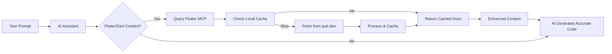

# Flutter MCP: Give Your AI Real-Time Flutter Superpowers 🚀

**A real-time MCP server providing Flutter/Dart documentation and pub.dev package info to AI assistants — supports ALL 50,000+ packages on demand.**

Stop fighting with hallucinated widgets and deprecated APIs. Flutter MCP connects your AI assistant to real-time documentation, ensuring the Flutter code it generates actually works.

<p align="center">
  <a href="https://www.npmjs.com/package/flutter-mcp"></a>
  <a href="https://www.npmjs.com/package/flutter-mcp"></a>
</p>

<p align="center">
  
  
  
  
</p>

<p align="center">
  <a href="#-quick-start">Quick Start</a> •
  <a href="#-demo">Demo</a> •
  <a href="#-features">Features</a> •
  <a href="#-how-it-works">How it Works</a> •
  <a href="#-contributing">Contributing</a>
</p>

## 🎬 Demo

<p align="center">
  
</p>

**See it in action**: From `npx flutter-mcp` to getting real-time Flutter documentation in 20 seconds.

## The Problem: Your AI is Stuck in 2021

<table>
<tr>
<td width="50%" align="center">

### 😡 Without Flutter MCP

```dart
// User: "How do I use Riverpod to watch a future?"

// AI generates (outdated):
final userProvider = FutureProvider((ref) async {
  return fetchUser();
});

// WRONG! Missing autoDispose, family, etc.
```

**Result**: Deprecation warnings, confused debugging, time wasted on Google

</td>
<td width="50%" align="center">

### ✅ With Flutter MCP

```dart
// User: "How do I use @flutter_mcp riverpod:^2.5.0 to watch a future?"

// AI generates (using v2.5.1 docs):
final userProvider = FutureProvider.autoDispose
  .family<User, String>((ref, userId) async {
    return ref.watch(apiProvider).fetchUser(userId);
});

// Correct, version-specific, actually works!
```

**Result**: Code works immediately, you ship faster

</td>
</tr>
</table>

## 🚀 Quick Start

### Installation

Get started in seconds with npm:

```bash
# One-line usage (no installation required)
npx flutter-mcp

# Or install globally
npm install -g flutter-mcp
flutter-mcp
```

That's it! No Python setup, no configuration, no complexity. The server automatically installs dependencies and starts running.

> **📢 For MCP SuperAssistant Users**: Use `npx flutter-mcp --transport http --port 8000` to enable HTTP transport!

### Alternative Installation Methods

<details>
<summary><strong>🐍 Python Package (pip)</strong></summary>

If you prefer using Python directly:

```bash
# Install from GitHub (PyPI package coming soon)
pip install git+https://github.com/adamsmaka/flutter-mcp.git

# Run the server
flutter-mcp-server start
```

</details>

<details>
<summary><strong>🔧 Install from Source</strong></summary>

For development or customization:

```bash
# Clone the repository
git clone https://github.com/adamsmaka/flutter-mcp.git
cd flutter-mcp

# Create virtual environment
python3 -m venv venv
source venv/bin/activate  # On Windows: venv\Scripts\activate

# Install in development mode
pip install -e .

# Run the server
flutter-mcp-server start
```

</details>

<details>
<summary><strong>🐳 Docker</strong></summary>

For containerized deployments:

```bash
# Docker image coming soon
# Run with Docker (once published)
# docker run -d -p 8000:8000 ghcr.io/adamsmaka/flutter-mcp:latest

# For now, use local development setup instead
pip install git+https://github.com/adamsmaka/flutter-mcp.git
```

</details>

<details>
<summary><strong>🎯 Single Executable (Coming Soon)</strong></summary>

```bash
# Download for your platform
curl -L https://github.com/flutter-mcp/flutter-mcp/releases/latest/flutter-mcp-macos -o flutter-mcp
chmod +x flutter-mcp
./flutter-mcp
```

No Python, no pip, just download and run!

</details>

### Requirements

- **Node.js 16+** (for npm/npx)
- Python 3.10+ is auto-detected and used by the npm package
- That's it! Built-in SQLite caching means no external dependencies

### 2. Add to Your AI Assistant

<details open>
<summary><strong>Claude Desktop</strong></summary>

Edit `~/Library/Application Support/Claude/claude_desktop_config.json`:

```json
{
  "mcpServers": {
    "flutter-docs": {
      "command": "npx",
      "args": ["flutter-mcp"]
    }
  }
}
```

Or if you installed globally:

```json
{
  "mcpServers": {
    "flutter-docs": {
      "command": "flutter-mcp"
    }
  }
}
```

Restart Claude Desktop after saving. The server will automatically install dependencies on first run.

</details>

<details>
<summary><strong>Claude Code (claude.ai/code)</strong></summary>

Create a `.mcp.json` file in your Flutter project root:

```json
{
  "mcpServers": {
    "flutter-docs": {
      "command": "npx",
      "args": ["flutter-mcp"]
    }
  }
}
```

Then run Claude Code in your project directory:
```bash
cd your-flutter-project
claude
```

Flutter MCP will automatically provide documentation for all packages in your `pubspec.yaml`.

**Alternative: Global npm install**

If you installed globally with `npm install -g flutter-mcp`:

```json
{
  "mcpServers": {
    "flutter-docs": {
      "command": "flutter-mcp"
    }
  }
}
```

**Important:** Don't use the `--dangerously-skip-permissions` flag when running Claude Code, as it prevents MCP servers from being loaded.

</details>

<details>
<summary><strong>Cursor / Windsurf</strong></summary>

In Settings → MCP Servers, add:

```json
{
  "flutter-docs": {
    "command": "npx",
    "args": ["flutter-mcp"]
  }
}
```

</details>

<details>
<summary><strong>MCP SuperAssistant</strong></summary>

MCP SuperAssistant requires HTTP transport. Configure it with:

1. Start the server with HTTP transport:
```bash
npx flutter-mcp --transport http --port 8000
```

2. In MCP SuperAssistant, add a new server:
   - **Name**: Flutter MCP
   - **URL**: `http://localhost:8000`
   - **Type**: HTTP MCP Server

3. The server will now be available in your MCP SuperAssistant client.

</details>

<details>
<summary><strong>VS Code + Continue</strong></summary>

In your `.continuerc.json`:

```json
{
  "models": [
    {
      "provider": "claude",
      "mcp_servers": {
        "flutter-docs": {
          "command": "npx",
          "args": ["flutter-mcp"]
        }
      }
    }
  ]
}
```

</details>

### 3. Start the Server (Optional for Testing)

<details>
<summary>Manual server control and transport options</summary>

```bash
# Default STDIO mode (for Claude Desktop)
npx flutter-mcp

# HTTP transport (for MCP SuperAssistant)
npx flutter-mcp --transport http --port 8000

# SSE transport
npx flutter-mcp --transport sse --port 8080

# Custom host binding
npx flutter-mcp --transport http --host 0.0.0.0 --port 3000

# If installed globally
flutter-mcp-server --transport http --port 8000
```

**Transport Options:**
- Default (no flag) - STDIO for Claude Desktop and most MCP clients
- `--transport http` - For HTTP-based clients like MCP SuperAssistant
- `--transport sse` - For Server-Sent Events based clients
- `--port PORT` - Port for HTTP/SSE transport (default: 8000)
- `--host HOST` - Host to bind to (default: 127.0.0.1)

Note: When configured in Claude Desktop, the server starts automatically using STDIO transport.

</details>

### 3. Use It!

Flutter MCP now features simplified tools following Context7's successful pattern - just 2 main tools instead of 5!

#### 🎯 New Simplified Usage (Recommended)

The AI assistant can now use Flutter MCP more intelligently:

```
# Universal search
"Search for Flutter animation widgets"
"Find state management packages" 
"Look for HTTP clients in pub.dev"

# Smart documentation fetching
"Show me Container widget documentation"
"Get the docs for provider package"
"Explain dart:async Future class"
```

#### 💫 Natural Language Support

Your AI will automatically detect Flutter/Dart content and fetch relevant docs:

```
"How do I implement infinite scroll with infinite_scroll_pagination?"
"Show me dio interceptors for auth tokens"
"What's the difference between bloc and riverpod?"
```

#### 🔧 Legacy Support

The `@flutter_mcp` mentions still work for backward compatibility:

```
"Explain @flutter_mcp freezed code generation"
"Show me all @flutter_mcp get_it service locator patterns"
```

### 🎯 Version-Specific Documentation (NEW!)

Get documentation for specific package versions using familiar pub.dev syntax:

```
# Exact versions
"Show me @flutter_mcp provider:6.0.5 breaking changes"
"How does @flutter_mcp riverpod:2.5.1 AsyncNotifier work?"

# Version ranges
"Compare @flutter_mcp dio:^5.0.0 vs @flutter_mcp dio:^4.0.0"
"What's new in @flutter_mcp bloc:>=8.0.0?"

# Special keywords
"Try @flutter_mcp get:latest experimental features"
"Is @flutter_mcp provider:stable production ready?"
```

See [Version Specification Guide](docs/VERSION_SPECIFICATION.md) for details.

## 📚 Available Tools

### 🎯 NEW: Simplified Tools (Context7-style)

Flutter MCP now provides just 2 main tools, making it easier for AI assistants to use:

### 1. `flutter_search` - Universal Search

Search across Flutter/Dart documentation and pub.dev packages with intelligent ranking.

```json
{
  "tool": "flutter_search",
  "arguments": {
    "query": "state management",
    "limit": 10  // Optional: max results (default: 10)
  }
}
```

Returns multiple options for the AI to choose from, including Flutter classes, Dart libraries, pub packages, and concepts.

### 2. `flutter_docs` - Smart Documentation Fetcher

Get documentation for any Flutter/Dart identifier with automatic type detection.

```json
{
  "tool": "flutter_docs",
  "arguments": {
    "identifier": "Container",              // Auto-detects as Flutter widget
    "topic": "examples",                    // Optional: filter content
    "max_tokens": 10000                     // Optional: limit response size
  }
}
```

Supports various formats:
- `"Container"` - Flutter widget
- `"material.AppBar"` - Library-qualified class
- `"provider"` - pub.dev package
- `"dart:async.Future"` - Dart core library

### 3. `flutter_status` - Health Check (Optional)

Monitor service health and cache statistics.

```json
{
  "tool": "flutter_status",
  "arguments": {}
}
```

---

### 📦 Legacy Tools (Deprecated but still functional)

The following tools are maintained for backward compatibility but internally use the new simplified tools:

<details>
<summary>View legacy tools</summary>

#### `get_flutter_docs` (Use `flutter_docs` instead)
```json
{
  "tool": "get_flutter_docs",
  "arguments": {
    "class_name": "Container",
    "library": "widgets"
  }
}
```

#### `get_pub_package_info` (Use `flutter_docs` instead)
```json
{
  "tool": "get_pub_package_info",
  "arguments": {
    "package_name": "provider",
    "version": "6.0.5"
  }
}
```

#### `search_flutter_docs` (Use `flutter_search` instead)
```json
{
  "tool": "search_flutter_docs",
  "arguments": {
    "query": "material.AppBar"
  }
}
```

#### `process_flutter_mentions` (Still functional)
```json
{
  "tool": "process_flutter_mentions",
  "arguments": {
    "text": "I need help with @flutter_mcp riverpod state management"
  }
}
```

#### `health_check` (Use `flutter_status` instead)
```json
{
  "tool": "health_check",
  "arguments": {}
}
```

</details>

## 🎯 Features

- **✨ NEW: Simplified Tools**: Just 2 main tools instead of 5 - following Context7's successful pattern
- **📦 Real-Time Documentation**: Fetches the latest docs for any pub.dev package on-demand
- **🎯 Version-Specific Docs**: Request exact versions, ranges, or use keywords like `latest`/`stable`
- **🚀 Zero Configuration**: Automatically detects packages from your `pubspec.yaml`
- **⚡ Lightning Fast**: Intelligent caching means instant responses after first fetch
- **🔒 100% Private**: Runs locally - your code never leaves your machine
- **🎨 Smart Context**: Provides constructors, methods, examples, and migration guides
- **♾️ Unlimited Packages**: Works with all 50,000+ packages on pub.dev
- **🤖 AI-Optimized**: Token limiting and smart truncation for efficient LLM usage

## 💡 How It Works

Flutter MCP is a local MCP server (think of it as a "RAG sidecar" for Flutter) built on the battle-tested Python MCP SDK. It enhances your AI with real-time documentation:



### The Magic Behind the Scenes

1. **MCP Integration**: Your AI assistant automatically detects when you're asking about Flutter/Dart packages
2. **Smart Detection**: No special syntax required - just mention package names naturally
3. **Lightning Cache**: First request fetches from pub.dev (1-2 seconds), subsequent requests are instant
4. **Context Injection**: Documentation is seamlessly added to your AI's knowledge before it responds
5. **Privacy First**: Everything runs locally - your code and queries never leave your machine

### Performance Notes

- ⚡ **First Query**: 1-2 seconds (fetching from pub.dev)
- 🚀 **Cached Queries**: <50ms (from local SQLite cache)
- 💾 **Cache Duration**: 24 hours for API docs, 12 hours for packages
- 🧹 **Auto-Cleanup**: Expired entries cleaned on access

### Error Handling

If documentation isn't available or a fetch fails, Flutter MCP gracefully informs your AI, preventing it from generating incorrect or hallucinated code based on missing information. Your AI will let you know it couldn't find the docs rather than guessing.

## 📊 What Gets Indexed

When you request a package, Flutter MCP extracts:

- ✅ **API Documentation**: Classes, methods, properties with full signatures
- ✅ **Constructors**: All parameters, named arguments, defaults
- ✅ **Code Examples**: From official docs and README files
- ✅ **Migration Guides**: Breaking changes and upgrade paths
- ✅ **Package Metadata**: Dependencies, platform support, versions

## 🛠️ Advanced Usage

<details>
<summary><strong>Debug Commands</strong></summary>

```bash
# Run with debug logging
DEBUG=true npx flutter-mcp

# Check server status and cache info
flutter-mcp-server --help
```

Note: Cache is automatically managed by the server. Cached documentation expires after 24 hours (API docs) or 12 hours (packages).

</details>

<details>
<summary><strong>Docker Deployment</strong></summary>

For production or team use:

```bash
# Run the server (Docker image coming soon)
# docker run -d -p 8000:8000 --name flutter-mcp ghcr.io/adamsmaka/flutter-mcp:latest

# Check logs
docker logs -f flutter-mcp
```

</details>

## 🛠️ Troubleshooting

<details>
<summary><strong>Error: spawn flutter-mcp ENOENT</strong></summary>

This error means the system cannot find the `flutter-mcp` command. Solutions:

1. **Use npx (recommended):**
```json
{
  "mcpServers": {
    "flutter-docs": {
      "command": "npx",
      "args": ["flutter-mcp"]
    }
  }
}
```

2. **Install globally first:**
```bash
npm install -g flutter-mcp
# Then use:
{
  "mcpServers": {
    "flutter-docs": {
      "command": "flutter-mcp"
    }
  }
}
```

3. **Check Node.js installation:**
```bash
node --version  # Should be 16+
npm --version   # Should be installed
```

</details>

<details>
<summary><strong>MCP server failed to start</strong></summary>

1. Check if Node.js 16+ is installed: `node --version`
2. Try running manually to see errors: `npx flutter-mcp`
3. The npm package will auto-install Python dependencies on first run
4. Check if Python 3.8+ is available: `python3 --version`
5. View detailed logs: `DEBUG=true npx flutter-mcp`

</details>

<details>
<summary><strong>Documentation not found errors</strong></summary>

- Some very new packages might not have documentation yet
- Private packages are not supported
- Try using the package name exactly as it appears on pub.dev

</details>

<details>
<summary><strong>Cannot connect from MCP client</strong></summary>

Different MCP clients require different transport protocols:

1. **Claude Desktop**: Uses STDIO transport (default)
   - No port/URL needed
   - Just use: `npx flutter-mcp`

2. **MCP SuperAssistant**: Requires HTTP transport
   - Start with: `npx flutter-mcp --transport http --port 8000`
   - Connect to: `http://localhost:8000`

3. **Custom clients**: May need SSE transport
   - Start with: `npx flutter-mcp --transport sse --port 8080`
   - SSE endpoint: `http://localhost:8080/sse`

If connection fails:
- Verify the correct transport mode for your client
- Check if the port is already in use
- Try binding to all interfaces: `--host 0.0.0.0`
- Ensure Node.js and npm are properly installed

</details>

## 📱 Client Configurations

Need help configuring your MCP client? We have detailed guides for:
- Claude Desktop
- MCP SuperAssistant  
- Claude Code
- VS Code + Continue
- Custom HTTP/SSE clients
- Docker configurations

**[→ View all client configuration examples](docs/CLIENT-CONFIGURATIONS.md)**

## 🤝 Contributing

We love contributions! This is an open-source project and we welcome improvements.

**[→ Read our Contributing Guide](CONTRIBUTING.md)**

### Quick Ways to Contribute

- 🐛 **Report bugs** - [Open an issue](https://github.com/flutter-mcp/flutter-mcp/issues)
- 💡 **Suggest features** - [Start a discussion](https://github.com/flutter-mcp/flutter-mcp/discussions)
- 📖 **Improve docs** - Even fixing a typo helps!
- 🧪 **Add tests** - Help us reach 100% coverage
- 🌐 **Add translations** - Make Flutter MCP accessible globally
- ⭐ **Star the repo** - Help others discover Flutter MCP

### 🚀 What's New & Coming Soon

**Recently Released:**
- ✅ **Simplified Tools**: Reduced from 5 tools to just 2 main tools (Context7-style)
- ✅ **Smart Detection**: Auto-detects Flutter widgets, Dart classes, and pub packages
- ✅ **Token Limiting**: Default 10,000 tokens with smart truncation
- ✅ **Topic Filtering**: Focus on specific sections (examples, constructors, etc.)

**On our roadmap:**
- 📚 Stack Overflow integration for common Flutter questions
- 🎯 Natural language activation: "use flutter docs" pattern
- 🌍 Offline mode for airplane coding
- 🚀 Hosted service option for teams

Want to help build these features? [Join us!](CONTRIBUTING.md)

## ❤️ Spread the Word

Help other Flutter developers discover AI superpowers:

<p align="center">
<a href="https://twitter.com/intent/tweet?text=Just%20gave%20my%20AI%20assistant%20Flutter%20superpowers%20with%20%40flutter_mcp!%20Real-time%20docs%20for%20any%20pub.dev%20package.%20No%20more%20outdated%20code!%20%23Flutter%20%23AI&url=https://github.com/flutter-mcp/flutter-mcp">
  
</a>
</p>


Add the badge to your project:

```markdown
[](https://github.com/flutter-mcp/flutter-mcp)
```

## 📄 License

MIT © 2024 Flutter MCP Contributors

## 🏗️ Built With

- **[Python MCP SDK](https://github.com/modelcontextprotocol/python-sdk)** - The most popular MCP implementation (14k+ stars)
- **[FastMCP](https://github.com/modelcontextprotocol/fastmcp)** - High-level Python framework for MCP servers
- **SQLite** - Built-in caching with zero configuration
- **npm/npx** - Simple one-line installation and execution
- **BeautifulSoup** - Robust HTML parsing
- **httpx** - Modern async HTTP client

---

<p align="center">
  <strong>Ready to give your AI Flutter superpowers?</strong>
  <br><br>
  <a href="#-quick-start">Get Started</a> • 
  <a href="https://github.com/flutter-mcp/flutter-mcp/issues">Report Bug</a> • 
  <a href="https://github.com/flutter-mcp/flutter-mcp/discussions">Request Feature</a>
  <br><br>
  Made with ❤️ by the Flutter community
</p>
